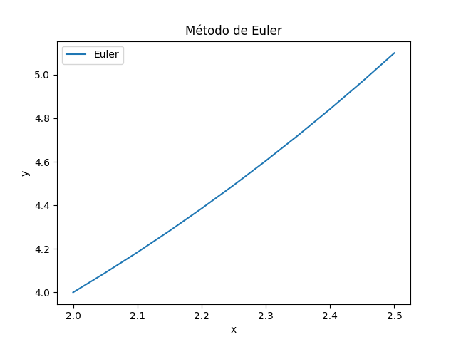
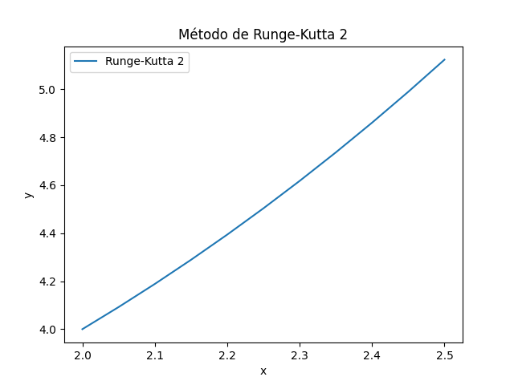

## Completar Datos

Para crear las gráficas, rellenamos los datos solicitados. Veamos:

Ecuación Diferencial:
 dx/dy=0.1np.sqrt(y)+0.4*x***2

Condiciones iniciales (x,y): x0 = 2, y0 = 4

Posición final: xf = 2.5

Número de iteraciones: n = 10

A continuación, le damos al botón de calcular y obtendrá una gráfica para cada método

## Método de Euler

El método de Euler es uno de los métodos numéricos más simples para resolver ecuaciones diferenciales ordinarias.

## Método de Runge-Kutta 2

El método de Runge-Kutta 2 es una mejora sobre el método de Euler, proporcionando mayor precisión.

## Método de Runge-Kutta 4

El método de Runge-Kutta 4 es uno de los métodos más utilizados debido a su precisión y estabilidad.

